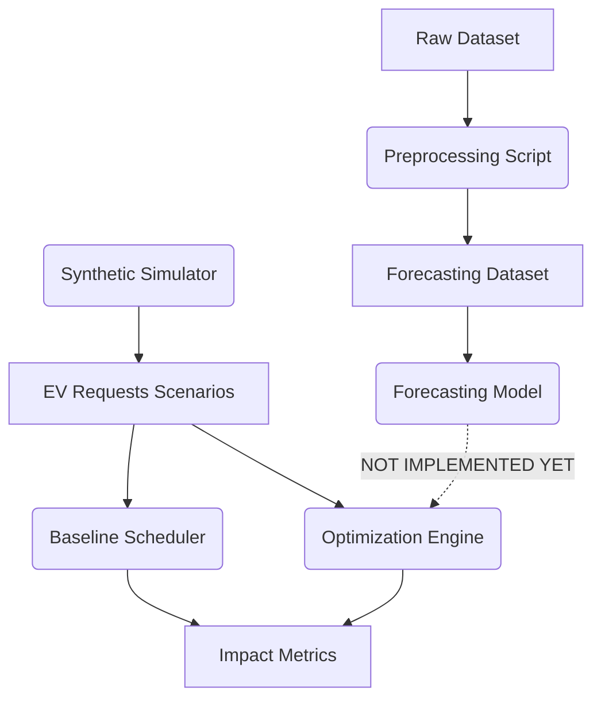

# SmartCharge: Project Status Report

## 1. PROJECT OVERVIEW
- **Project name:** SmartCharge
- **One-line purpose:** Forecast EV charging demand and intelligently schedule flexible EV charging sessions to reduce grid peak load while satisfying EV charging requirements and deadlines.
- **Current hackathon:** First Commit / Bharat Builds Tour
- **Track we are targeting:** Ship It

## 2. CURRENT SYSTEM ARCHITECTURE


*Note: The forecasting model exists and trains successfully, but its predictions are currently NOT dynamically piped into the optimization engine as `background_load`.*

## 3. DATASET
- **Dataset Path:** `data/ev_charging_demand.csv`
- **Number of Rows:** 8,354
- **Number of Columns:** 27
- **Number of Stations:** 20
- **Number of Vehicles/Sessions:** 8,354 (unique sessions)
- **Timestamp Range:** `2025-01-01 00:00:00` to `2025-03-29 00:15:00`
- **Missing Values / Duplicates:** 0 / 0
- **Important Numeric Ranges:** `battery_capacity_kWh` (30-100), `initial_soc` (10-60%), `charging_demand` (0 to ~105 kW)
- **Important Categoricals:** `location_type`, `weather_condition`, `traffic_density`

### Data Pipeline
**RAW DATA** (15-min intervals) → **preprocessing** (drop session-specific leakage) → **aggregation** (Hourly `.mean()` for target, `.mean()`/`.mode()` for features) → **final forecasting dataset**.

- **Forecasting Target:** `charging_demand`
- **Target Unit:** kW (Power)
- **Aggregation Method:** `mean()` over the hour
- **Time Resolution:** 1-hour intervals

## 4. FEATURE ENGINEERING

| Feature | Used? | Source | Lagged? | Known at prediction time? | Purpose |
| :--- | :---: | :--- | :---: | :---: | :--- |
| `lag_1_demand` | Yes | Preprocessed Data | Yes | Yes | Autoregressive baseline state |
| `lag_1_load` | Yes | Preprocessed Data | Yes | Yes | Station utilization state |
| `lag_1_queue` | Yes | Preprocessed Data | Yes | Yes | Station congestion state |
| `lag_1_weather_condition` | Yes | Preprocessed Data | Yes | Yes | Environmental modifier |
| `lag_1_traffic_density` | Yes | Preprocessed Data | Yes | Yes | Congestion modifier |
| `lag_1_electricity_price` | Yes | Preprocessed Data | Yes | Yes | Cost incentive modifier |
| `lag_1_renewable_energy_ratio`| Yes | Preprocessed Data | Yes | Yes | Grid sustainability state |
| `hour`, `day_of_week` | Yes | Calendar | No | Yes | Cyclical demand patterns |
| `is_peak_hour`, `is_weekend` | Yes | Calendar | No | Yes | Categorical time bands |
| `station_id`, `location_type` | Yes | Static Metadata | No | Yes | Spatial constants |

*Leakage Risks:* All remaining leakage risks have been successfully eliminated by shifting state and environmental variables to `t-1`.

## 5. FORECASTING
- **Model Type:** Random Forest Regressor
- **Training Script:** `models/forecasting/train.py`
- **Prediction Script:** `models/forecasting/predict.py`
- **Evaluation Script:** `models/forecasting/evaluate.py`
- **Train/Test Split:** Time-aware sequential split (80% Train, 20% Test)
- **Forecast Horizon:** 1 hour ahead
- **Baseline Model:** Naive Persistence (`t-1` = `t`)

### Current Results
**Naive Baseline:**
- MAE: 17.20 kW
- RMSE: 33.94
- MAPE: 90.24%

**ML Model (Random Forest):**
- MAE: 17.24 kW
- RMSE: 23.96
- MAPE: 76.95%

*Explanation:* By removing concurrent leakage variables, the MAE performs similarly to the baseline on average errors, but the ML model heavily outperforms the baseline on large penalty spikes (evidenced by the massive drop in RMSE from 34 -> 24), accurately preempting major demand spikes.

## 6. SYNTHETIC EV SIMULATOR
- **EV Count:** 500 per scenario
- **Station Assignment Logic:** Uniformly distributed using actual historical probabilities (~5% per station).
- **Battery Capacity:** Uniform [30, 100] kWh
- **Initial SOC:** Uniform [10, 60] %
- **Target SOC:** Uniform [80, 100] %
- **Charging Power:** Weighted selection [7, 11, 22, 50] kW
- **Arrival Time:** Scenario-dependent (e.g., 80% evening peak)
- **Departure Deadline:** `arrival_time + min_charging_time + flexibility_buffer`
- **Flexibility Buffer:** Scenario-dependent (e.g., 8.0 to 12.0 hours)

**Energy Required Formula:**
```python
Energy Required = Battery Capacity * (Target SOC - Initial SOC) / 100.0
```

*Data Distinction:* The underlying statistical distributions (station capacities, station assignment probabilities) are inferred from **REAL DATA FROM KAGGLE**, but the specific EV request schedules generated are **SYNTHETIC SIMULATION INPUTS**.

## 7. OPTIMIZATION ENGINE
- **Algorithm / Library:** Linear Programming (LP) via `PuLP` (`CBC` Solver).
- **Time Resolution:** Discretized down to 0.5 hours (30 minutes).
- **Decision Variables:** `P[ev][i]`, continuous charging power (kW) for a specific EV at a specific time slot.
- **Objective Function:** `Minimize: Z + 0.0001 * Total_Charging_Delay` (Where `Z` is the peak total grid load. The delay penalty serves as a strictly weighted tie-breaker).

### Schedulers
- **Baseline Scheduler:** An algorithmic ASAP scheduler. EV begins charging at `max_charging_power` the moment it arrives and continues until full. Constraints are only checked post-facto.
- **SmartCharge Scheduler:** The mathematical LP optimizer that strategically throttles/shifts charging power to flatten the curve without violating physical limits.

### Constraints (Hard)
- **Station constraints:** Sum of `P` for EVs at station `s` <= 105.0 kW.
- **Grid constraints:** Sum of `P` across all EVs <= 2500 kW.
- **Deadline constraints:** EV cannot charge before arrival, and must finish before deadline.
- **Energy constraints:** Total `P * dt_hours` must exactly equal `energy_required_kWh`.
- **Infeasibility Handling:** If physically impossible, PuLP strictly returns `Infeasible` and the engine passes this upward without hallucinating a valid schedule.

## 8. SCENARIOS

**NORMAL_EVENING**
- *EV Count:* 500 | *Stations:* 20 | *Grid Cap:* 2500 kW | *Station Cap:* 105 kW
- *Profile:* 80% evening arrivals, large flexibility (8-12 hours).
- **RESULTS:** 
  - Baseline Peak: 3610 kW
  - SmartCharge Peak: 852 kW
  - Peak Reduction: 76.4%
  - Grid Violations: 0
  - Feasible: YES

**HIGH_STRESS**
- *Profile:* High battery capacity, low initial SOC, low flexibility (1-4 hours).
- **RESULTS:** Feasible: **NO** (Mathematically fails due to local-station hardware bottlenecks).

**TIGHT_DEADLINE**
- *Profile:* Normal capacity/SOC, near-zero flexibility (0-0.5 hours).
- **RESULTS:** Feasible: **NO** (EVs are forced to charge immediately, overwhelming the stations).

**INFEASIBLE**
- *Profile:* Negative flexibility buffers (must leave before charging can possibly finish).
- **RESULTS:** Feasible: **NO**.

## 9. TESTING
- **Test Files:** `tests/test_optimizer.py`
- **Type of Tests:** 5 unit tests validating optimizer invariants (normal, evening peak, tight deadlines, insufficient capacity, impossible scenario).
- **Latest Pytest Result:** `5 passed, 229 warnings in 1.01s`

**Verified Properties:**
- [x] energy conservation
- [x] deadline compliance
- [x] grid capacity
- [x] station capacity
- [x] charger capacity *(represented via aggregate station capacity)*
- [x] arrival constraints
- [x] impossible scenario handling
- [x] baseline/optimized parity

## 10. FORECAST → OPTIMIZER INTEGRATION
**STATUS: NOT INTEGRATED**

Currently, the forecasting model outputs are entirely isolated from the optimization engine. 
- In `scripts/run_final_validation.py`, `run_demo.py`, and `run_optimization.py`, the engine is invoked as:
```python
smart_res = run_smart_schedule(requests, grid_capacity, station_capacities, dt_hours=0.5)
```
- *Missing:* The `background_load` parameter in the engine is functionally built to accept a predicted load vector, but there is no code that calls `predict_demand()`, extracts a forecast, and injects it into `run_smart_schedule()`.

## 11. CURRENT AWS STATUS
- **S3:** NOT STARTED
- **Lambda:** NOT STARTED
- **API Gateway:** NOT STARTED
- **DynamoDB:** NOT STARTED
- **Amplify:** NOT STARTED
- **Bedrock:** NOT STARTED

## 12. CURRENT FRONTEND STATUS
- **Frontend Status:** NOT IMPLEMENTED
- No frameworks, pages, or components exist in the repository.

## 13. CURRENT DEMO STATUS
1. Load dataset: **YES**
2. Forecast demand: **YES**
3. Generate EV requests: **YES**
4. Run baseline: **YES**
5. Run SmartCharge: **YES**
6. Show before/after: **YES** (Via Matplotlib `.png` generation)
7. Explain optimization: **PARTIAL** (No Bedrock AI integration exists yet)
8. Access through API: **NO**
9. Access through deployed website: **NO**

## 14. FILE/FOLDER MAP
```text
models/
  forecasting/
    train.py                 → Trains the Random Forest forecasting model.
    predict.py               → Module interface for generating predictions.
    evaluate.py              → Calculates MAE/RMSE and visualizes predictions.
  optimization/
    engine.py                → The PuLP-based LP baseline and optimization engine.
scripts/
  preprocess.py              → Cleans raw data and generates non-leaky target/features.
  simulator.py               → Generates synthetic constrained scenario CSVs.
  run_final_validation.py    → Evaluates optimizer against all 4 scenarios with assertions.
  run_demo.py                → Prints an end-to-end load curve demo.
tests/
  test_optimizer.py          → Validates LP physical bounds and failure handling.
docs/                        → Various generated readmes (EDA, Audit, Simulation rules).
reports/                     → Auto-generated JSON and PNG outputs from validation runs.
```

## 15. COMPLETED MILESTONES
- [x] Dataset audit
- [x] Data preprocessing
- [x] Feature engineering (lagged states)
- [x] ML Forecasting pipeline
- [x] Synthetic EV request simulator
- [x] Baseline scheduler engine
- [x] Linear Programming (LP) SmartCharge engine
- [x] Optimization verification & hardening pass

## 16. CURRENT BLOCKERS
**CRITICAL**
- The forecasting output is not piped into the optimization engine as `background_load`.

**IMPORTANT**
- AWS infrastructure does not exist, blocking deployment.
- Frontend dashboard does not exist, blocking user presentation.

**OPTIONAL**
- Forecasting model struggles with zero-inflated sparse demand.

## 17. TECHNICAL RISKS / ASSUMPTIONS
- **Continuous Throttling:** Assumes charging hardware can smoothly and continuously adjust power draw to fractions of a kW, rather than simple ON/OFF binaries. 
- **Global Batch Knowledge:** The optimizer assumes it perfectly knows the arrivals and deadlines of all EVs within a 24-hour batch. Real deployments require rolling-horizon updates (MPC) as EVs dynamically arrive.
- **Unbounded Scaling:** LP matrices solve 500 EVs in ~1 second, but will scale polynomially and run out of RAM if applied simultaneously to 50,000 EVs in a metropolitan simulation. 

## 18. NEXT RECOMMENDED MILESTONE
**FINAL INTEGRATION (FORECAST → OPTIMIZER)**
Before migrating to AWS, a bridging module must be written to query the `predict_demand()` model, extract a 24-hour forecasted base grid load, and seamlessly pass it into the `background_load` parameter of the optimization engine.

## 19. EXECUTIVE SUMMARY

**CURRENT STATE:** 
The core physics, data engineering, and optimization mathematics are fundamentally sound and verified. The backend successfully processes data, trains a forecasting model, simulates requests, and mathematically optimizes grid peaks without violating constraints.

**NOT YET DONE:** 
The forecast predictions are not yet injected into the optimizer. There is zero AWS infrastructure or Frontend UI.

**BIGGEST TECHNICAL GAP:** 
The `predict_demand()` output is entirely decoupled from `run_smart_schedule()`. 

**NEXT STEP:** 
Build the software bridge integrating the forecaster output as the `background_load` constraint for the optimizer, finalizing the core backend prior to AWS deployment.
